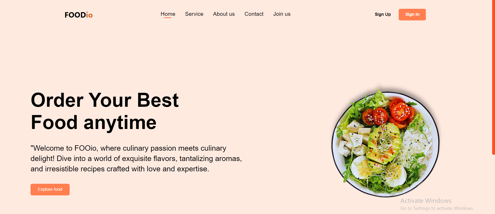
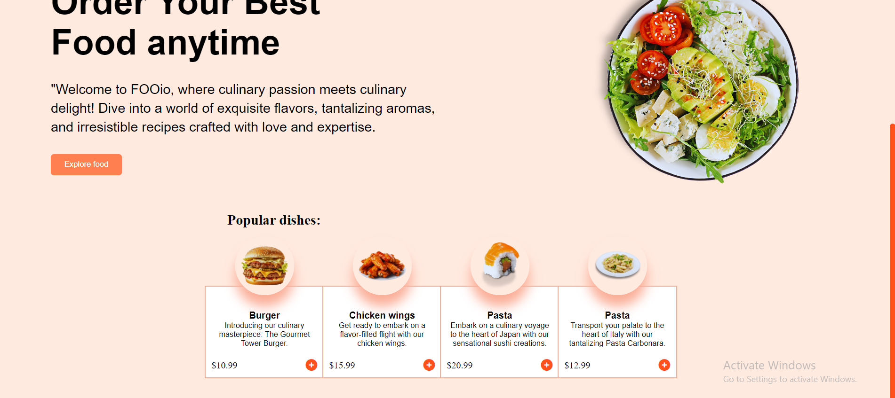
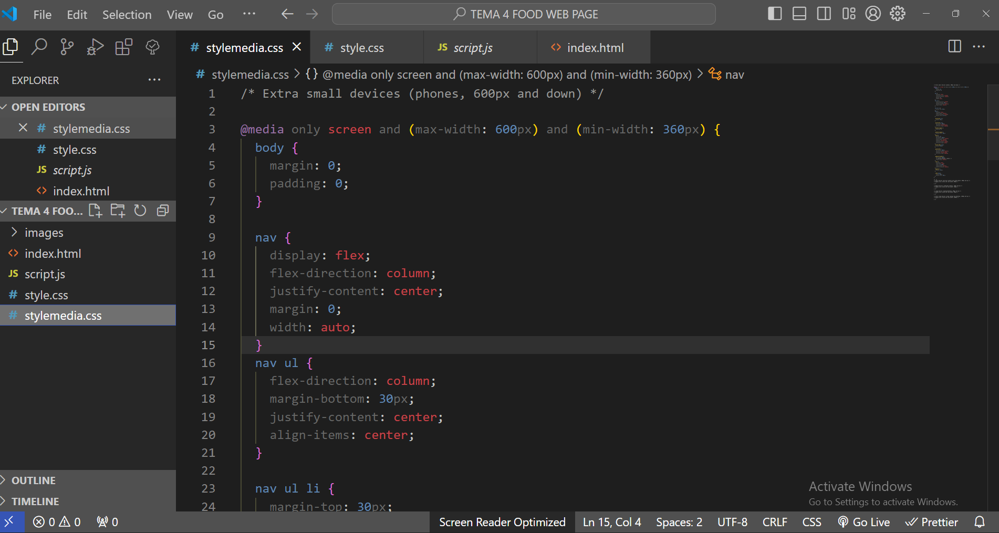
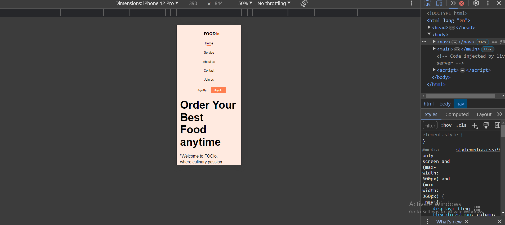

# FOODio-Webpage
My first Food Delivery Application for both Web and Mobile
My first Responsive Design for an Food Delivery App using HTML5 and CSS3. The page dynamics is due to CSS animation. The Popular dishes list items were ctyled using position relative and absolute, as well flexbox layout. I also took advantage of pseudoelements and pseudoclasses for styling. 

Here are some SCREENSHOTS to see efatures of my project and my code:

